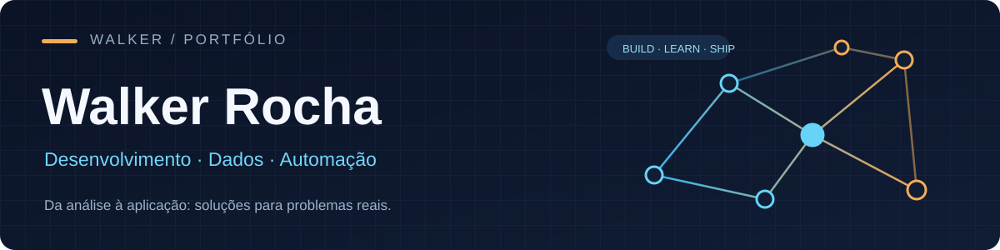

### Olá, sou o Walker 👋

Sou **desenvolvedor júnior na Assurance IT** e curso **Ciência de Dados e Inteligência Artificial na PUC Minas**. Gosto de pegar um problema, entender os dados e construir algo que funcione na prática — seja uma aplicação, uma integração ou uma análise.

Hoje trabalho com **desenvolvimento de soluções digitais, APIs e automações**. Na universidade, exploro **bancos de dados, análise de dados e aprendizado de máquina**. Também participo de uma pesquisa sobre tratamento e unificação de bases de criminalidade no Brasil.

**Belo Horizonte, MG** · [LinkedIn](https://www.linkedin.com/in/walker-rocha-09a86525b/) · [E-mail](mailto:walker.investimentos31@gmail.com)

---

## Seleção de projetos

### 01 / [DPOC em idosos brasileiros e perfil nutricional](https://github.com/WalkerRocha/Artigo_Dpoc_em_Idosos)

Estudo com os microdados da **PNS 2019** para investigar fatores associados ao diagnóstico autorreferido de DPOC em pessoas com 60 anos ou mais. Comparei Árvore de Decisão, Random Forest e Balanced Random Forest em uma base desbalanceada. O repositório contém o [artigo completo em PDF](https://github.com/WalkerRocha/Artigo_Dpoc_em_Idosos/blob/main/Relatorio_Final_DPOC_Idosos_PNS_2019.pdf) e os resultados, incluindo as limitações do estudo.

`Análise de dados` `Aprendizado de máquina` `Saúde pública`

### 02 / [Mercado de Ciência de Dados no Brasil](https://github.com/WalkerRocha/ppl-cd-pcd-sist-int-2025-1-regional-disparities-data-mkt)

Projeto acadêmico em equipe baseado no **State of Data Brazil 2023**. Analisei com o grupo características e trajetórias de profissionais da área de dados, com exploração da base, preparação de atributos e modelos de classificação.

`Análise exploratória` `Árvore de Decisão` `Random Forest`

### 03 / [Banco de Dados Escola Help](https://github.com/WalkerRocha/Projeto_de_banco_de_dados-_ll_)

Projeto acadêmico em equipe de um sistema para gerenciar aulas, turmas e matrículas. O trabalho percorre requisitos, modelagem conceitual e lógica, diagramas e scripts SQL.

`SQL` `Modelagem relacional` `Diagramas`

**Mais projetos:** [atividades da PUC Minas](https://github.com/WalkerRocha/University-activities-and-projects---PUC-Minas) · [todos os repositórios públicos](https://github.com/WalkerRocha?tab=repositories)

---

## O que faço no trabalho

**Desenvolvedor Júnior · Assurance IT** dez/2024 — atual

Desenvolvo e mantenho soluções digitais, conecto sistemas por APIs, automatizo processos e participo de testes e documentação técnica. A experiência combina desenvolvimento convencional com ferramentas de automação e criação rápida de produtos.

## Ferramentas que uso

| Desenvolvimento | Dados | Automação e produto |
| --- | --- | --- |
| Python · JavaScript · Java · C/C++ · Git | SQL · Power BI · ETL · Machine Learning | n8n · Lovable · Supabase · APIs REST |

**Formação:** Ciência de Dados e Inteligência Artificial, PUC Minas (em andamento).

---

Construindo, estudando e documentando o caminho. [Vamos conversar no LinkedIn →](https://www.linkedin.com/in/walker-rocha-09a86525b/)
